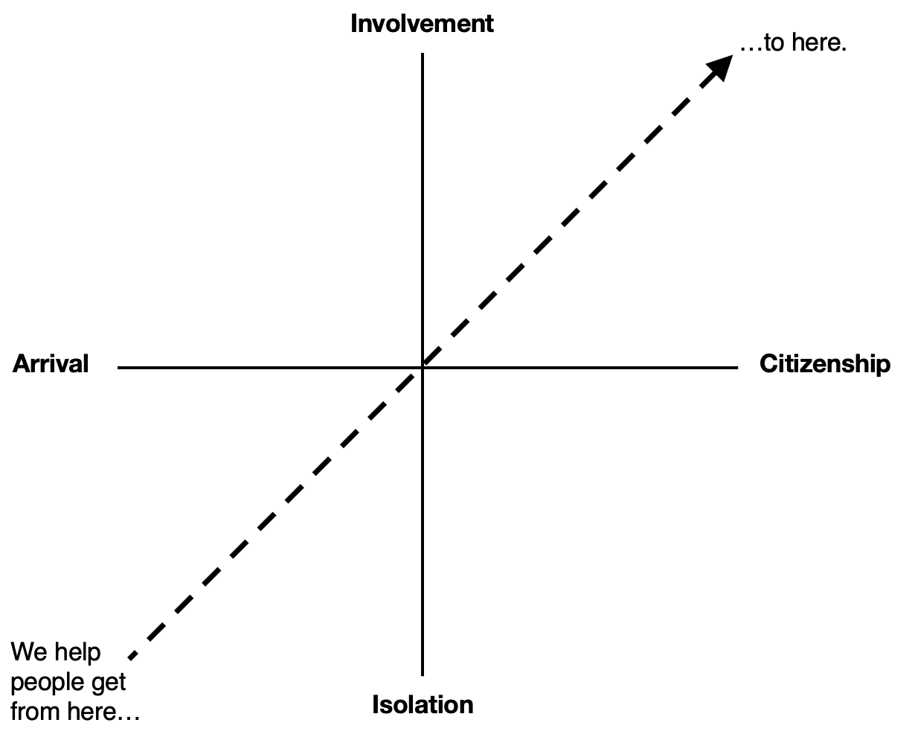

# Why we exist
What's the point of the ICC? Why are we necessary?

Good questions! Let's dive in.

## Our purpose
Many public benefit organizations have really long-winded and ambiguous purpose statements that makes it difficult to know what they're all about. Maybe they think this approach affords them flexibility to appeal to a wider range of supporters, but the reality is that ambiguity demotivates staff and turns off donors. We don't want to do that!

Our purpose statement is designed to be short, clear, and inspiring. It commits us to a clear, principled course:

> The ICC works to unlock Canada for newcomers, facilitating and encouraging the journey towards full and active Canadian citizenship.

You could draw it out like this:

<bordered-image alt="ICC purpose diagram" src="_media/icc-purpose-diagram.png"></bordered-image>

Some important details to remember:

1. The "citizenship" part of our name refers to newcomers obtaining citizenship.
2. Citizenship is a legal status but also a state of mind. We care about the legal status but we care more about the feeling of belonging.

__TLDR; *We do everything we can so that newcomers fall in love with Canada, become citizens, and build their futures here.*__

<!--  -->

## Why Canada needs us
Canada is in desperate need of renewal. Immigration is our best option for achieving it. There are economic and non-economic reasons for greater immigration, which we'll get into shortly.

But we must also remember that there has to be something in it for the immigrants too. They will only stay and contribute to our shared success if they find a good life here. That means Canada's success depends on immigrants' success. When they love it here, we all thrive. The ICC's programs help newcomers to have positive experiences on the journey to citizenship. As you'll see below, our success in delivering these experiences is a matter of essential national importance. 

### A dying country
Our population is aging *really* fast.

<bordered-image alt="ICC purpose diagram" src="_media/pop-over-65-bar-chart.png"></bordered-image>

By 2030, the entire Baby Boomer generation will have reached retirement age. It will cost *a lot* to care for them in their old age, but the number of working-age people continues to decline. When public healthcare came to be, there were nearly 5 taxpaying workers for every benefit-collecting retiree. Today, we're closing in on 2-to-1.

If we want to sustain our prosperous society and the generous public services that come with it, we need more working people. The average women is having fewer babies, meaning that immigration is now responsible for the lion's share of Canada's population growth.

<bordered-image alt="Population change block chart" src="_media/population-change-block-chart.png"></bordered-image>

Immigrants are not just new people, they're also the right people. They are far younger than the average Canadian...

<bordered-image alt="Age distribution bar chart" src="_media/age-distribution-bar-chart.png"></bordered-image>

...and far better educated too.

<bordered-image alt="Education distribution bar chart" src="_media/education-distribution-bar-chart.png"></bordered-image>

It's no wonder then that immigrants are behind some of Canada's strongest startups, like Shopify (founded by German-born Tobias Lütke) and ApplyBoard (founded by the Iranian-born Basiri brothers).

__*The moral of the story is quite compelling: if we bring the best, we can be the best.*__

This applies to the non-economic realm too. Thanks to newcomers and their kids who quite literally wrapped themselves in the Maple Leaf, Canada qualified for the 2022 World Cup, ending a 36-year drought.

<bordered-image alt="Canada men's soccer tea" src="_media/soccer-qualified.jpeg"></bordered-image>

One of Canada's biggest hit shows, which succeeded domestically and abroad, is _Kim's Convenience_, written by Korean immigrant, Ins Choi. It's a story that can only happen here, and and audiences around the world lapped it up.

<bordered-image alt="Kim's convenience cast covershot" src="_media/kim-cover.png"></bordered-image>

Tareq Hadhad has become an international sensation since arriving in Canada in 2016 as a refugee from Syria. His hugely successful business, Peace by Chocolate, has shown the world why Canada's openness to newcomers is such a good idea. His story has now been turned into a feature film, with Canada's welcoming disposition playing a central role. Tareq became a citizen at the first available opportunity. He then became a Canoo member and now contributes actively to the ICC.

<bordered-image alt="Tareq Hadhad becomes a Canadian citizen" src="_media/tareq-citizenship.jpeg"></bordered-image>

### Crisis of confidence emerging

<cta-arrow target="programs.md" text="Programs"></cta-arrow>
